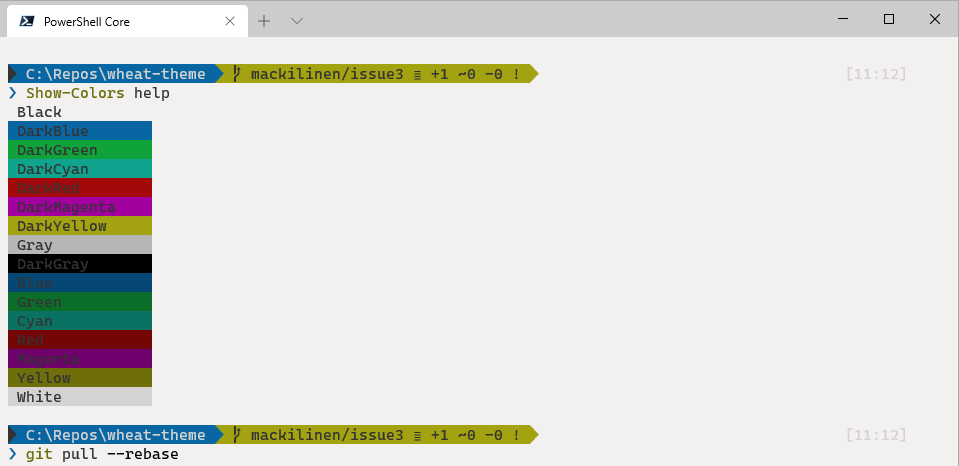

# Wheat Theme for Windows Terminal

A light theme for [Windows Terminal](https://github.com/microsoft/terminal)

## Screenshot

## Installation

Some ways of installing this theme:

- Copy the content of the [themes/wheat-theme.json](themes/wheat-theme.json) and paste it into `schemes` in the settings file.
- Download **wheat-theme-windows-terminal.zip** file from [releases](https://github.com/mackilinen/wheat-theme/releases), extract it and Copy the content of the `themes/wheat-theme.json` and paste it into `schemes` in the settings file.
